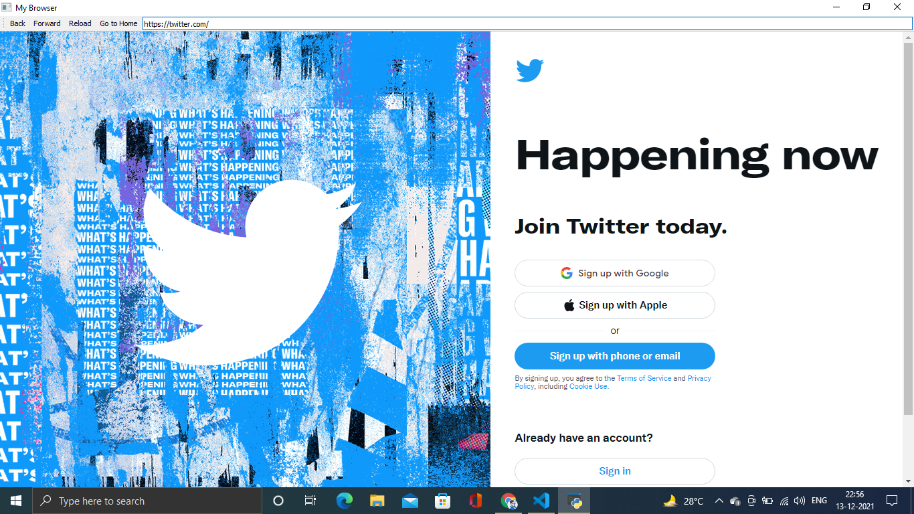

# ✔ PERSONEL-BROWSER
- This is my personel browser with some core functionalities of a browser developed in python.
- In this browser, user will be able to browse anything and can even go to a website directly by their URL.
- for implementing this I have used PyQt5 library in python.

****

## Libraries used
* I have mainly used the **PyQt5** library to implement this.
* [**_`PyQt5`_**](https://pypi.org/project/PyQt5/) PyQt5 is cross-platform GUI toolkit, a set of python bindings for Qt v5. Qt is set of cross-platform C++ libraries that implement high-level APIs for accessing many aspects of modern desktop and mobile systems. Anyone can develop an interactive desktop application with so much ease because of the tools and simplicity provided by this library.

****

### How this Script works :
- for using it, you just need to install above library in your system.
- User just need to download the file and run the my-browser.py on their local system.
- Now on the main window of the application the user can browse for anything and can go to any websites by their URL.

### Purrpose :
- We can just use our own personel browser and surf the internet in it.

****

### SCREENSHOTS :

   
   

****

### Author :
- Amaan Khan
